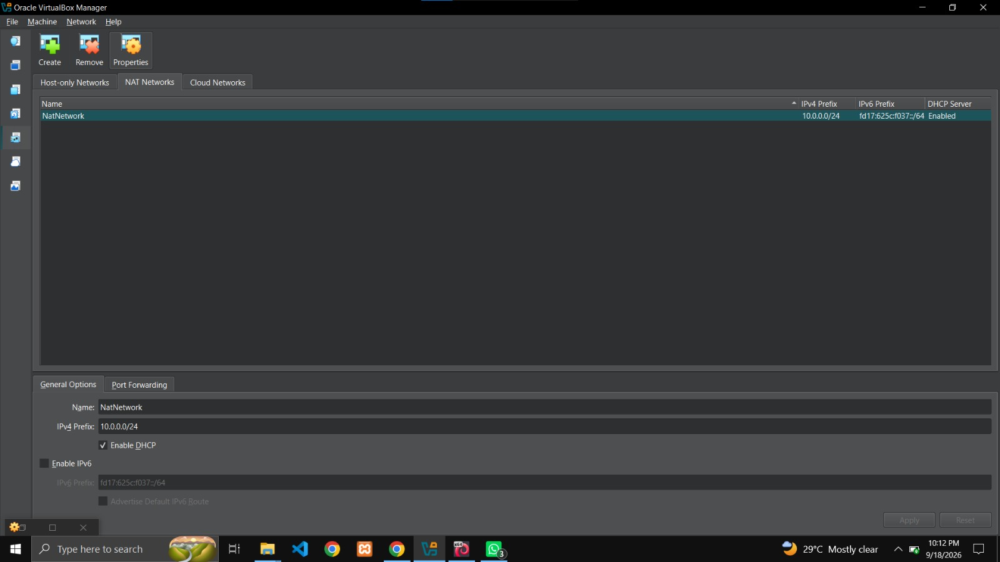
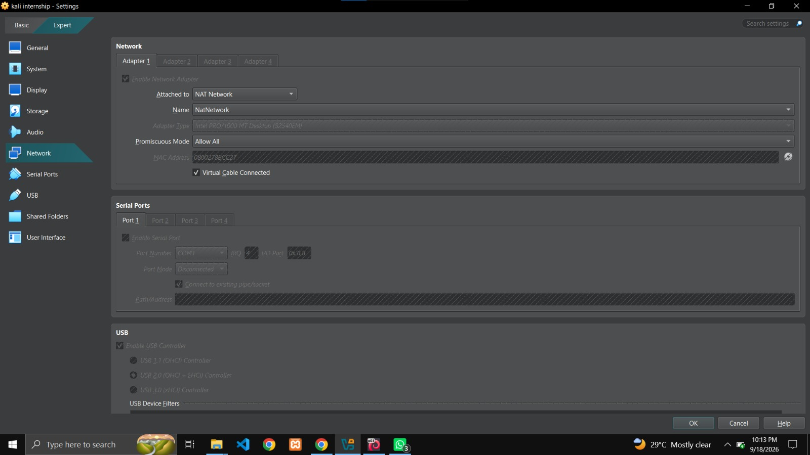
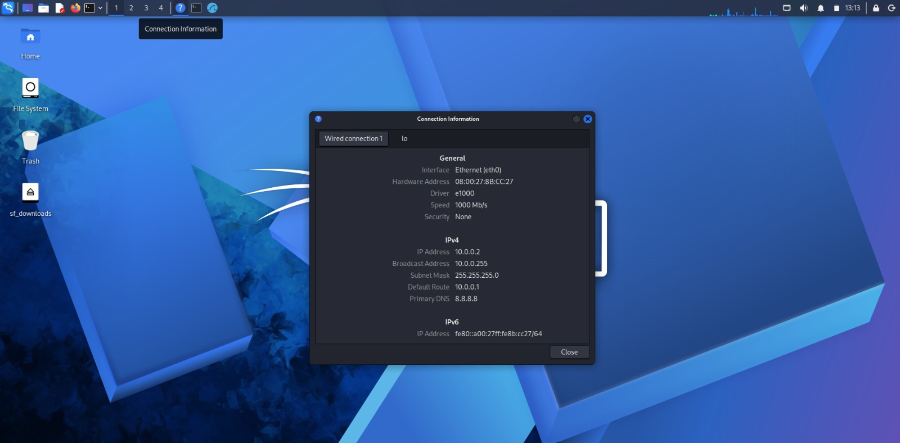
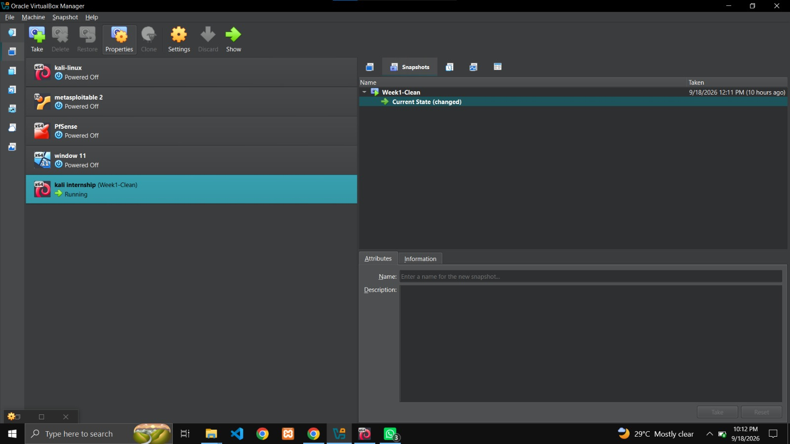
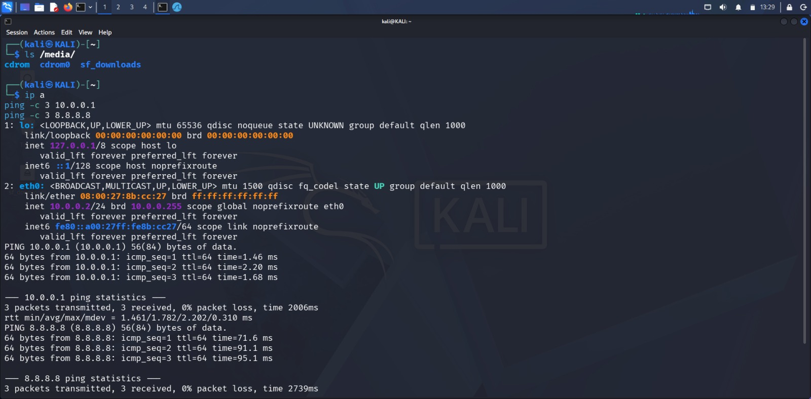
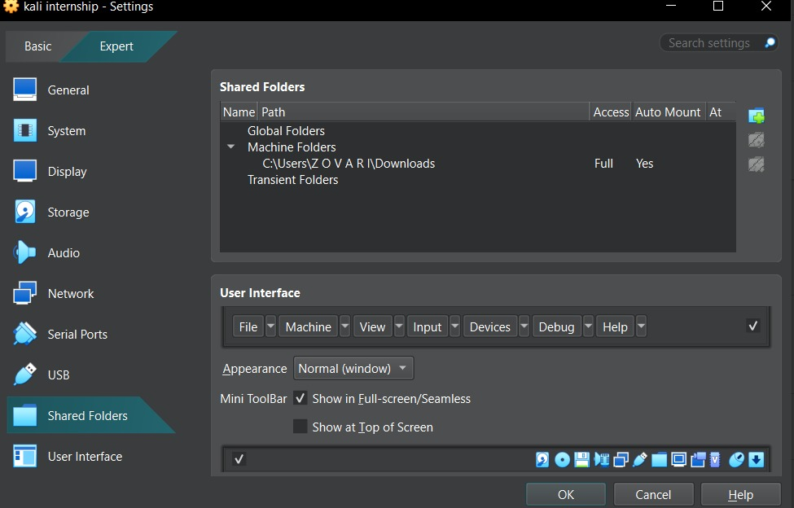

# Networkwalks B083F – Week 1 Cybersecurity Lab Setup

## Project Overview

This repository documents my Week 1 lab setup for the Networkwalks Ethical Hacking & Cybersecurity internship. The goal was to build a safe, isolated virtual lab using VirtualBox and Kali Linux so I can practice cybersecurity techniques without affecting real systems.

## Week 1 Objectives

- Install 7-Zip for extracting compressed VM files
- Install VirtualBox (latest version)
- Create a NAT Network on 10.0.0.0/24
- Import a Kali Linux VM
- Configure Kali with static IP 10.0.0.2/24
- Verify internet connectivity from Kali
- Take a clean snapshot of the working VM
- Document the whole process with screenshots

## Lab Configuration

| Component | Configuration |
|-----------|---------------|
| Host OS | Windows 11 |
| Host | HP Laptop |
| Hypervisor | VirtualBox 7.2.14 |
| Security OS | Kali Linux |
| Kali RAM | 4096 MB |
| Kali Disk | 25 GB |
| Virtual Network | NAT Network |
| Network Address | 10.0.0.0/24 |
| Kali IP | 10.0.0.2/24 |
| Gateway | 10.0.0.1 |
| DNS | 8.8.8.8 |
| Adapter Type | Intel PRO/1000 MT Desktop |

## Lab Setup Procedure

### Step 1 – Install 7-Zip
I installed 7-Zip on my Windows laptop so I could extract the compressed Kali Linux virtual machine package downloaded from kali.org.

### Step 2 – Install VirtualBox
I installed VirtualBox 7.2.14 from virtualbox.org and confirmed that it launched correctly.

### Step 3 – Create the NAT Network
I created a NAT Network in VirtualBox and named it NatNetwork, with the following settings:

- Name: NatNetwork
- IPv4 Prefix: 10.0.0.0/24
- DHCP: Enabled
- IPv6: Disabled

### Step 4 – Import / Clone Kali Linux
I imported the Kali Linux VM into VirtualBox and attached Adapter 1 to the NatNetwork.

### Step 5 – Configure Kali Linux Network
I configured a static IPv4 address inside Kali using nmcli so the VM would use the correct network settings for the lab:

sudo nmcli connection modify "Wired connection 1" ipv4.addresses 10.0.0.2/24 ipv4.gateway 10.0.0.1 ipv4.dns 8.8.8.8 ipv4.method manual

sudo nmcli connection down "Wired connection 1"

sudo nmcli connection up "Wired connection 1"

### Step 6 – Snapshot
After confirming everything worked, I took a clean snapshot of the VM and named it Week1-Clean. This gives me a restore point that I can return to if anything breaks in future lab work.

## Lab Verification

| Test | Command | Result |
|------|---------|--------|
| IP address | ip a | 10.0.0.2/24 |
| Gateway | ping 10.0.0.1 | 0% packet loss |
| Internet | ping 8.8.8.8 | 0% packet loss |

## Shared Folders

I configured a shared folder named downloads from my Windows host (C:\Users\ZOVAR\Downloads) so I can easily transfer files between the host and Kali.

## Problems Encountered & Solutions

### 1. Network was set to plain NAT instead of NAT Network
Problem: The VM was attached to plain NAT (VirtualBox default) instead of NAT Network, which placed the VM on a different subnet (10.0.2.0/24). The gateway 10.0.0.1 was unreachable.

Solution: I changed Adapter 1 from NAT to NAT Network and selected NatNetwork.

### 2. NAT Network prefix was wrong
Problem: When I first created the NAT Network, the IPv4 prefix was 10.0.2.0/24 (VirtualBox default) instead of 10.0.0.0/24.

Solution: I edited the NAT Network and set the IPv4 Prefix to 10.0.0.0/24.

### 3. IPv4 address was lost on eth0
Problem: After changing the adapter type, eth0 lost its IPv4 address and only kept IPv6. Pings returned Destination Host Unreachable.

Solution: I re-applied the manual IP using nmcli connection modify and cycled the connection down and up.

### 4. VirtualBox 7 + Kali 2026.x DAD timeout bug
Problem: Even with correct settings, Kali sometimes lost internet connectivity due to a known DAD (Duplicate Address Detection) timeout issue.

Solution: I ran sudo nmcli connection modify "Wired connection 1" ipv4.dad-timeout 0, then brought the connection down and up again.

### 5. MAC address conflict between original and clone
Problem: Cloning the Kali VM initially kept the same MAC address as the source VM, which would have caused network conflicts.

Solution: During cloning, I selected "Generate new MAC addresses for all network adapters".

## What I Learned

- Virtual networking: How VirtualBox NAT Network differs from plain NAT and Bridged.
- Kali network configuration: Using nmcli to set static IP, gateway, and DNS.
- Troubleshooting: Diagnosing Destination Host Unreachable step by step.
- Snapshots: The value of a clean restore point before starting future labs.
- Documentation: Recording every step, error, and fix as part of a technical project.

## Week 1 Status

- Lab setup completed successfully.
- Kali Linux configured with correct IP and internet access.
- Snapshot Week1-Clean saved.
- Ready for Week 2 practical exercises.

## Tools Used

- 7-Zip
- VirtualBox 7.2.14
- Kali Linux (pre-built VM)
- Windows 11
